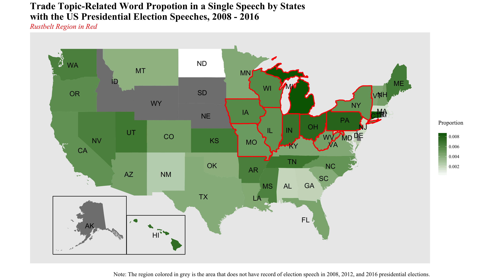

```{r setup, include=FALSE}
knitr::opts_chunk$set(echo = TRUE)
```

# Part 1: Visualization critique

The target data visualization that I choose is [Fig. 2. Median 10-K section length by year](https://github.com/uc-dataviz/critique-Alicechung/blob/master/graph.pdf) from the paper 
`The evolution of 10-K textual disclosure: Evidence from Latent Dirichlet Allocation` (Dyer, Lang and Stice-Lawrence, 2017). As the title of graph tells, the graph shows the median length of 10-K sections every year from 1996 to 2013. Overall, I would say the graph is good example of visualization of the finding. However, through conducting critique of the visualization based on the five qualities of visualization (truthful functional, beautiful, insightful, and enlightening), I will add several points to improve the truthfulness of the visualization of the target graph. 

- Is it truthful?

I think this graph is truthful. At first sight, this graph delivers the trend of median 10-K section length by year. This graph only considers the available 22,348 documents for identifying all sections, so it does not hide any missing data and the data is available for every year. The authors choose to use the median length to show the objectivity of unit to show their finding. The graph itself is clear and simple to interpret since the author choose to use color to distinguish each 13 sections and draw by year. However, if the authors include the total number of documents or the number of dropped documents, and provide the proportion, it might add more honesty and validity to believe the information from the graph. In addition, adding the year information in the title, from 1996 to 2013 would show the clear purpose of the graph and eliminate the possible suspicion of disguising the truth of the data. 

- Is it functional?

This graph provides enough functional advantages to the audience. The main purpose of this graph is clearly stated in the title “Median 10-K section length by year”. Even though this graph does not have stated x-axis and y-axis labels, we can simply infer from the title that x-axis indicates years and y-axis indicates length. The interval of y-axis is 5,000 so it is hard to get the precise number of length each year but it is easy to see how the proportion of each 13 sections varies year to year and what sections varies the most. Also authors assign colors to each 13 sections and locate the legend describing the colors and the labels of sections below the graph. With this legend, the audience can easily interpret the trends of each sections by year. I think the authors do well on the selection of graph-shape. Instead of drawing 13 solid lines, the authors choose to use mountain plots to show the proportion and changes of each sections clearly. However, not all of 13 sections accounts for large portion in the graph to show its changes across the years, so it is hard to interpret if I want to see how the median length of label 3 changes across the years. I think if the authors add the information of the sections that are not changed less than specific criteria (e.g. 1% of total length), it is much clear and efficient to focus on the main findings, the total number of length keep growing and the large portion is led by 1&2, 7 and 8. In addition, without reading the paper, it is hard to get the units of length in the graph so it would be better for the audience to interpret accurate if the authors add the definition of ‘length’ at y-axis level or captions. 

- Is it beautiful?

Since the graph uses the colors and mountain plots, it is attractive and intriguing. Not even the aesthetically pleasing, with using these features the audience can easily get the informative findings. The use of colors and the choose of graph-shape are clearly not for the decorations but to improve deliverability of trends in median 10-K section length in years. However, the use of colors to assign 13 sections can be improved because the colors are dark and similar and some of sections are not changed very large, so it is important to set those group of sections with different colors to emphasize the main findings of the graph. 

- Is it insightful?

This graph is clearly insightful to reveal and provide the findings of the paper. If the numbers of the median 10-K section length by each 13 sections by every year are shown in the table, it is hard to interpret the trends at one sight. Of course if it is in table format, the audience may take more time and hard time to catch the changes of median 10-K section length. At one sight, the main purpose of the graph is clearly delivered so I think this graph is insightful enough. Not perceiving 10-K document as total number of length, it is important to perceive 10-K documents as specified sections within 10-K documents and the length of each sections and this graph is clearly show this aspect. 

- Is it enlightening?

From above four qualities (truthful functional, beautiful, insightful), I think the target graph is enlightening. The selection of topic also enlightens to the field of textual analysis in accounting. As I mentioned in insightfulness, this graph introduces the one aspect of viewing and analyzing the 10-K documents with several sub-topics and this can give the enlightenment to other researchers who wants to do text analysis in accounting field. For the aspect of “do good with the data”, I believe the data itself is good enough to do analyze and contains plentiful textual information and fully audited by the government and SEC (Securities and Exchange Commission). The purpose, methods and implication of analyzing and visualizing the 10-K documents benefits the people to provide the causal inference of economic events to the content changes of 10-K documents.

# References
Dyer, T., Lang, M., Stice-Lawrence, L, (2017), "The evolution of 10-K textual disclosure: Evidence from Latent Dirichlet Allocation," Journal of Accounting and Economics, Elsevier, vol. 64(2), pages 221-245.  https://ideas.repec.org/a/eee/jaecon/v64y2017i2p221-245.html


```{r 2, include=FALSE}
library(ggplot2)
library(maps)
library(ggmap)
library(gapminder)
library(fiftystater)
library(rgdal)
library(dplyr)
library(tidyr)
library(tidyverse)
library(stringr)
library(modelr)
library(forcats)
library(rgeos)
library(maptools)
library(gpclib)
library(gridExtra)
library(purrr)
library(extrafont)
library(scales)
library(zoo)
font_import()
#loadfonts(device="win") 
fonts() 
setwd("~/Desktop/2018WINTER/PLSC43502/ML_finalPJT")
```
```{r 3, include=FALSE, eval=FALSE}
pro_state <- read.csv('~/Desktop/2018WINTER/PLSC43502/ML_finalPJT/Data/pro_state_rust.csv')
propo <- data.frame(state = tolower(rownames(pro_state)), pro_state)
names(propo) <- c("state", "id", "proportion")
map_pro <- merge(fifty_states, propo, by="id",all.x=TRUE)
data("fifty_states")
dd <- data.frame(abb = state.abb, id = tolower(state.name))
cnames <- aggregate(cbind(long, lat) ~ id, data=fifty_states, 
                    FUN=function(x)mean(range(x)))
cnames <- left_join(cnames, dd, by = c ("id"))

rust_ex <- c('illinois','pennsylvania', 'west virginia',
             'ohio', 'indiana', 'michigan','illinois',
             'iowa', 'wisconsin', 'missouri', 'new york')
filter<- fifty_states[fifty_states$id %in% rust_ex,]

p <- ggplot(map_pro, aes(map_id =id)) + 
  geom_map(aes(fill = proportion), map = fifty_states) +
  geom_map(map = subset(fifty_states, id %in% rust_ex),
           fill = NA, colour = "red", size = 1, alpha = 0.2) +
  expand_limits(x = fifty_states$long, y = fifty_states$lat) +
  geom_text(data= cnames, aes(long, lat, label = abb), size = 5) +
  coord_map() +
  scale_fill_gradient(low="white", high="darkgreen", name="Proportion \n")+
  scale_x_continuous(breaks = NULL) + 
  scale_y_continuous(breaks = NULL) +
  labs(x = "", y = "", 
       title = "Trade Topic-Related Word Propotion in a Single Speech by States \nwith the US Presidential Election Speeches, 2008 - 2016",
       subtitle = "Rustbelt Region in Red",
        caption ='Note: The region colored in grey is the area that does not have record of election speech in 2008, 2012, and 2016 presidential elections.') +
  theme(plot.title = element_text(size =20, face = "bold"), 
        plot.subtitle = element_text(size =15, color = "red", face = "italic"),
        text = element_text(family = "Times New Roman", size = 12),
        plot.caption = element_text(size = 12))

p1<- p + fifty_states_inset_boxes() 
ggsave("~/Desktop/2018SPRING/DV/HW1/rust_sw_saliencemap_fin.png", width = 14, height = 8, dpi = 300)
dev.off()
```

# Part 2: `ggplot2` and the grammar of graphics 



This graph tells the story about the degree of trade-topic salience by states in presidential election speeches from 2008 to 2016. The main variable of the graph is the proportion of trade-related words mentioned in each speech document and this is operationalized as the percentage of total frequency of trade-related words divided by total number of unigrams in single speech document. The proportion is illustrated by the saturation of the color, here is from white to dark green. The darker the color, the more are trade salience speeches delivered in the target states. Also I add the red line for indicating the rust-belt regions which refers the regions known as the manufacturing heartland in U.S. From the graph, we can find that presidential candidates do speak more trade-related words per speech in rust-belt region. 

I select to use U.S map and the heat-map style because my data set and the object of showing this proportion is to show whether there are any differences to use topic-related words in the presidential speech by states. So this data should be illustrated by the U.S map and it is efficient to show the differences of proportions using the level of color saturation since it is easy to perceive, interpret, eye-catching and beautiful. 

Since the object and data are based on location information, all the states of U.S, I use to encode the data by States. It is a heat-map style and the shape of U.S map is appropriate to use horizontal position so the graph has wide width and a bit relatively short height. To get concentration on the U.S map, I decide not to use any sky-blue color for the background. Since I put emphasize to point the rust-belt regions with red lines, I choose to use white to dark green color scale because green and red are complementary color. By using complementary color, I can efficiently emphasize two important information that I want to deliver to the audience. I also put the legend to indicate the scale level of proportions on the left side so that the audience also get the sense of interpreting what the saturation of color means. For whom does not familiar with U.S map, I decide to include the abbreviation of state name at the center point of each states. I also add information to interpret the colors in the graph at the bottom side of the graph saying the region colored in grey means the areas that do not have the record of election speech from 2008 to 2016 presidential elections because I use white color to indicate 0 so sometimes people perceive white color is same as missing or unavailable data which is wrong. 

For drawing U.S map in `ggplot2`, I made data transformation on the `fifty_states` dataset to get the longitude and latitude points by every states. This is important step because my main dataset only contains the state name and the proportion data so it is not possible to draw U.S map. I merged main dataset with `fifty_states` dataset using state name. In addition, I need to calculate the center point of each state to position the abbreviation of state name, so I made another data frame that contains the center point (longitude, latitude) of each states and the name from `fifty_states`. From these two dataset, I draw U.S map with the proportion and add the state name above U.S map.

I believe the choices I made on the shape, color, size, scale, position, title, notation and caption facilitate the interpretation of the graph. As I described above, the use of complementary colors would emphasize the two important information that I want to deliver on the U.S map and this is quite obvious not to miss the information. I personally think heat-map is very effective to deliver the scale of target variable and show how the scale is distributed with the saturation of color. It is often pleasing to see and interpret the information and make people to feel ease with the graph. Since this graph is solely provided, without any explanation or history, I tried to add important concept of the data in the title, subtitle and caption. If the concept is not simple and drawn by complicate calculation, it is efficient to express the concepts with text because text is relatively explicit to deliver the information. However, if the text is verbose, it ruins the simple and clarity feature of the graph so I tried keep the balance between the delivery and conciseness. 
 

